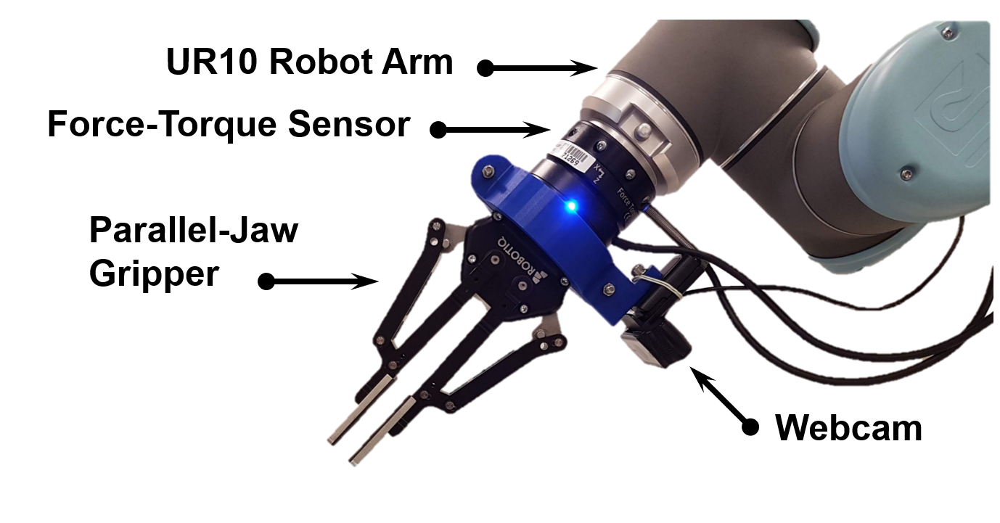
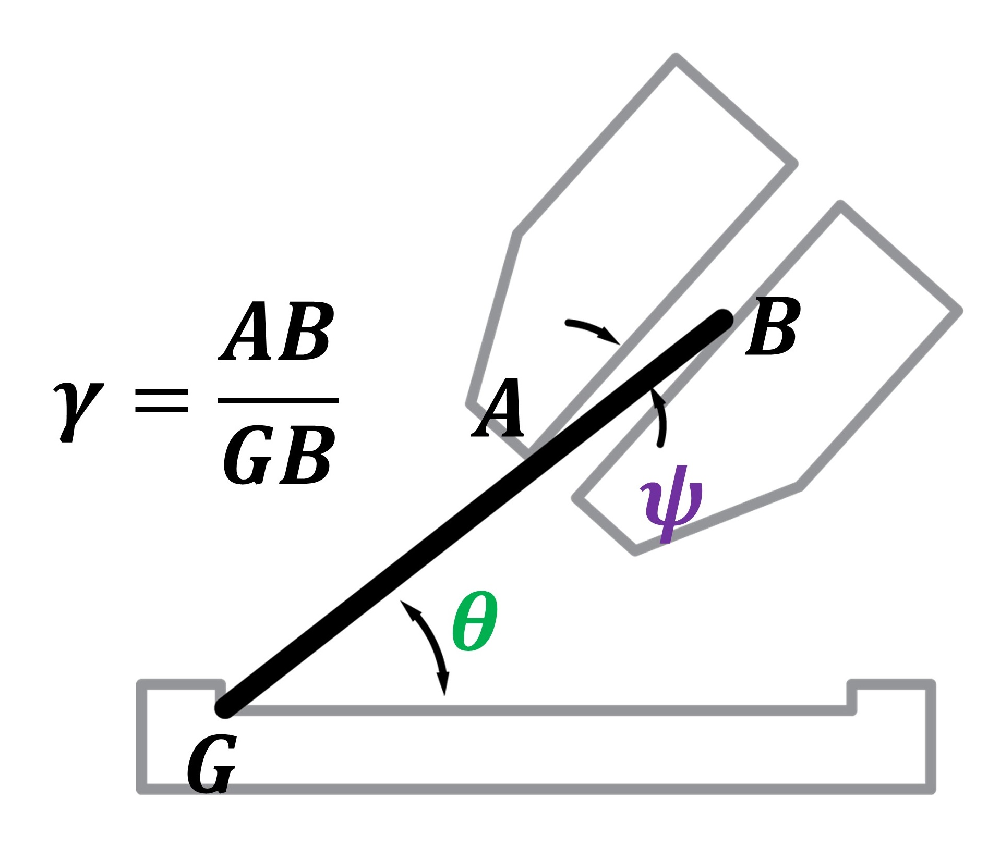
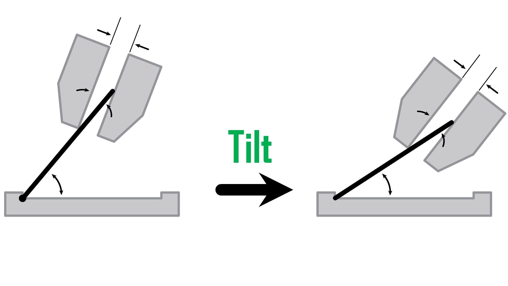
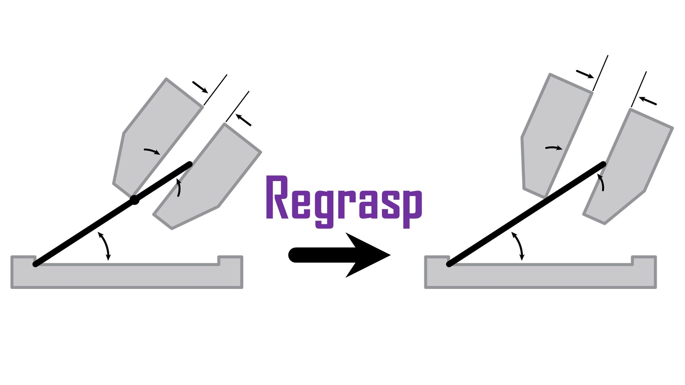
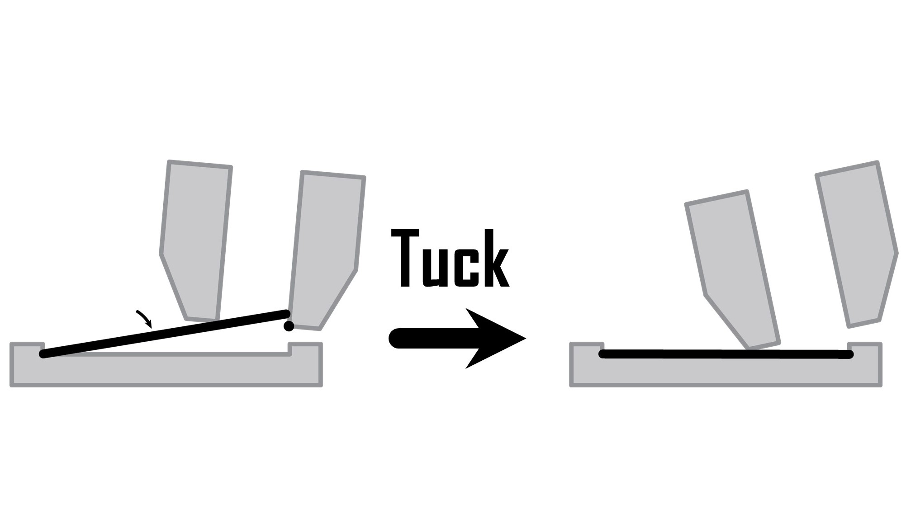

# Dexterous Ungrasping (Shallow-Depth Insertion)

## 1. Overview

This package is an implementation of **Dexterous Ungrasping**, which refers to the task of securely transferring an object from the gripper to the environment through dexterous manipulation, like the way players would place stones in the game of Go. Our technique features dexterous manipulation actions that combine into a complete ungrasping operation as seen in the animations below. Dexterous ungrasping is generalized from our previous work, shallow-depth insertion, for addressing the task of placement without the concavity at the environment, which is more difficult than insertion. This package is directly applicable to a simple hardware setting with the conventional parallel-jaw gripper installed on an industrial robot arm. 

**Note:** This package is also for implementing **Shallow-Depth Insertion (SDI)**: a novel robotic manipulation technique suitable for assembling thin peg-like objects into a hole with a shallow depth, as can be seen in a cell phone battery insertion for example. 

### *Shallow-Depth Insertion* 
<p align = "center">
 
 

</p>

### *Dexterous Ungrasping*
<p align = "center">
 
 

</p>

**Full Video Link:** 
1. [Shallow-Depth Insertion](https://www.youtube.com/watch?v=Nka-sCzrcSs)
2. [Dexterous Ungrasping](https://www.youtube.com/watch?v=KXN6uyKoGSU)


**Published Article**

- C. H. Kim, K. H. Mak, and J. Seo, "[Dexterous Ungrasping: Planning, Control, and Design for Secure Placement and Insertion through Dexterous Manpulation]()," submitted to *SAGE Journals: The International Journal of Robotics Research (IJRR)* (Under review). 

- C. H. Kim and J. Seo, "[Shallow-Depth Insertion: Peg in Shallow Hole Through Robotic In-Hand Manipulation](https://ieeexplore.ieee.org/document/8598749)," in *IEEE Robotics and Automation Letters*, vol. 4, no. 2, pp. 383-390, April 2019.

    *If you use shallow-depth insertion for your application or research, please star this repo and cite our related paper.* [(BibTeX)](files/BibTeX.txt)

**Contributers**: [Chung Hee Kim](https://sites.google.com/view/chjohnkim/home), [Ka Hei Mak](https://github.com/ansonmak), and [Jungwon Seo](http://junseo.people.ust.hk/)  

## 2. Prerequisites

### 2.1 Hardware
- [**Universal Robot UR10**](https://www.universal-robots.com/products/ur10-robot/) Industrial Robot Arm 

- [**Robotiq 2F-140**](https://robotiq.com/products/2f85-140-adaptive-robot-gripper) Adaptive Parallel Jaw Gripper
- [**Robotiq FT300**](https://robotiq.com/products/ft-300-force-torque-sensor) Force Torque Sensor
- **Webcam**
- **Optional**: [**Extendable Palm Device**](https://github.com/HKUST-RML/extendable_palm_device) for implementation of immobilized insertion

<p align = "center">

</p>

### 2.2 Software
- Our package was developed in [**Ubuntu 16.04**](http://releases.ubuntu.com/16.04/) and [**ROS Kinetic**](http://wiki.ros.org/ROS/Installation).
- [**MoveIt!**](http://docs.ros.org/kinetic/api/moveit_tutorials/html/index.html): ROS robot planning framework
- [**ur_modern_driver**](https://github.com/ros-industrial/ur_modern_driver): ROS driver for UR10 robot controller from Universal Robots
- [**universal_robots**](http://wiki.ros.org/action/show/universal_robots?action=show&redirect=universal_robot): ROS-Industrial support for Univrsal Robots manipulators
- [**robotiq_2finger_grippers**](https://github.com/chjohnkim/robotiq_2finger_grippers.git): ROS driver for Robotiq Adaptive Grippers
- **Optional**: [**dynamixel_motor**](http://wiki.ros.org/dynamixel_motor): ROS interface with Robotis Dynamixel line of servo motors to control the extendable palm device


## 3. Build on ROS
In your [catkin workspace](http://wiki.ros.org/catkin/Tutorials/create_a_workspace):
```
cd ~/catkin_ws/src
git clone https://github.com/HKUST-RML/shallow_depth_insertion.git
cd ..
catkin_make
```

## 4. Run Shallow-Depth Insertion
### 4.1 Run in Simulation
SDI can be visualized in simulation through Gazebo and RVIZ. The robot arm motion is simulated but the object-robot contact interaction is currently not availble. 
To visualize the robot arm motion:
```
roslaunch shallow_depth_insertion ur10_robot.launch simulation:=true
roslaunch shallow_depth_insertion gripper.launch sim:=true
rosrun shallow_depth_insertion SDI_main.py
```

### 4.2 Run with Real Robot
If you are able to meet the basic hardware requirements (robot arm and gripper), you can execute SDI with the real robot:
```
roslaunch shallow_depth_insertion ur10_robot.launch simulation:=false
roslaunch shallow_depth_insertion gripper.launch
rosrun shallow_depth_insertion SDI_main.py
```

### 4.3 Changing execution parameters
The parameters of the SDI process can be specified in config/sdi_config.yaml.
The parameters are as follows:
- **Robot Parameter**
    - ***tcp_speed***: Robot tool center point (TCP) speed
- **Gripper Parameter**
    - ***tcp2fingertip***: Distance from TCP to gripper fingertip
    - ***finger_thickness***: Thickness of the robot finger
    - ***gripper_speed***: Gripper actuation speed between 0.013 and 0.100
    - ***gripper_force***: Gripper force between 0 and 100 (%)
- **Object Dimension**
    - ***object_thickness***: object thickness in meters
    - ***object_length***: object length in meters
- **SDI configuration**:
    - ***theta_0***: Angle between object and hole prior to regrasping
    - ***delta_0***: Distance from fingertip to object tip within gripper in meters
    - ***psi_regrasp***: Angle between object and upper finger after regrasping
    - ***theta_tilt***: Angle to tilt after regrasping
    - ***axis***: Axis and direction to rotate about using right-hand rule

## 5. Dexterous Ungrasping

### 5.1 Immobilized Insertion

- Implementing immobilized insertion requires the use of the extendable palm device. Please refer to the instructions [here]() for setting up the device. Once the palm device is installed on the base gripper and the software prerequisites are satifised, you can control the extendable plam device via dyanmixal servos:  

```
roslaunch shallow_depth_insertion dynamixel.launch
rosrun shallow_depth insertion dynamixel.py
```

- The following input commands can be used to control the extendable palm in the ```dynamixel.py``` executable:
    - **e**: fully extend
    - **c**: fully contract
    - **f**: increase speed
    - **s**: decrease speed
    - integer between **115** and **152**: setting position of the extendable palm (unit in mm)

- To execute battery insertion with palm assistance on the real robot: 

```
rosrun shallow_depth_insertion SDI_battery_main.py
```

### 5.2 Precision Placement

- Precision placement can be executed in the same way shallow-depth insertion is executed. No additional hardware or software is required. For example, to execute precision placement of a coin on a real robot:

```
rosrun shallow_depth_insertion PP_coin.py
```


## 6. Background
SDI is composed of three primitive operations: **tilt**, **regrasp**, and **tuck**. The three manipulation primitives are utilized to navigate the configuration space of the object-gripper-hole system, which is parameterized as follows:
- ***θ*** : Angle formed between the object and the hole surface
-  ***ψ*** : Angle formed between the object and the gripper upper finger
- ***γ*** : Ratio of the object enclosed by the gripper over the object length

<p align = "center">

</p>

The three primitive operations navigate the configuration space as follows:

- **Tilt**: Changes ***θ*** by rotating the gripper-object system about the corner of the hole. No change in ***ψ*** and the distance between the two fingers.
- **Regrasp**: Changes ***ψ*** by rotating the gripper about the tip of the gripper upper finger. No change in ***θ***, but the distnace between the two fingers are coordinated accordingly. 
- **Tuck**: Changes ***θ*** and ***ψ*** by rotating the gripper about the tip of the gripper lower finger. 

***γ*** is fixed initially and remains fixed throughout the SDI process. 

<p align = "center">
&nbsp;&nbsp;&nbsp;&nbsp;&nbsp;&nbsp;&nbsp;&nbsp;&nbsp;&nbsp;&nbsp;&nbsp;&nbsp;&nbsp;&nbsp;&nbsp;&nbsp;&nbsp;&nbsp;&nbsp;
</p>

## 7. License 
The source code is released under MIT license. 

## 8. Maintenance 
For any technical issues, please contact John Kim [chkimaa@connect.ust.hk]() and Ka Hei Mak [khmakac@connect.ust.hk]().
